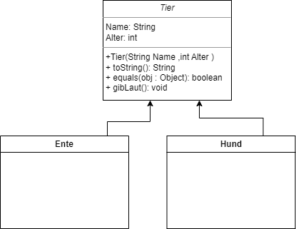

# Java Basics
## Vertstaendniss 
#### 1. Bewerten Sie ob folgende Aussagen korrekt oder Falsch und Begruenden Sie ihre Entscheidungen.
  1. Eine Klasse kann auch keinen Konstruktor haben wenn diesen nicht Implementieren.
  2. Eine Klasse kann beliebig viele Konstruktoren haben.
#### 2. Erklaeren Sie die Sichbarkeit in bezug auf Attributen bzw. Methoden von Klassen und den Zugriffsmodifikatoren **public**, **private**,**static** und ohne Modifikator.
#### 3. Durch welches Schluesselwoert verbiete ich das Ueberschreiben einer Methode bzw. Variablen?
#### 4. Was gibt uns die default Methode toString() zurueck?
#### 6. Was tut die deafult Methode equals(Object obj)?
#### 7. Warum eigentlich wird eigentlich ein Objekt der Klasse Object benutzt.
#### 8. Was versteht man unter dynamischen Bindung und was sind die Vorteile.
#### 9. Was ist ein Paket?
#### 10. Was fuer Konsequenzen einstehen wenn ich keinen Zugriffsmodifikator bein einr Klassendeklaration mit angebe?

## Praktisch
#### 1. Implementieren Sie folgendes Diagramm mit Hilfe von Abstraktion und Polymorohie

#### 2. Realisieren Sie folgendes diagramm. Ueberlegen Sie sich welche Methoden Sie ueberladen mochten und wie. Beachtet Sie so viel wie Moeglich aus der Superklasse Wieder zu verwenden. Beruecksichtigen Sie auch die dynamische Bindung(Polymorphie)

#### Erweiteren Sie ihre Klasse Tier um das Interface Tierverhalten welche die Methoden **move()** und **gibLaut()**.
#### 3. Fuellen Sie folgende Tabelle aus.
|      | Innerhalb der selben Klasse | Innerhalb des selben Paketes | In Unterklassen | In sonstigen Klassen |
|------|-----------------------------|------------------------------|------------------|----------------------|
| private | | | | |
| (ohne) | | | | |
| protected | | | | |
| public | | | | |
#### 4. Fuellen Sie folgende Tabelle aus.
|      | normale Klasse | Abstrakte Klassen | Interfaces |
|------|----------------|-------------------|------------|
| Schluesselwort (Defintion) | | | | |
| Schluesselwort (Weiderverwendung) | | | | |
| Mehrfachvererbung moeglich| | | | |
| Enthaelt Methoden **mit** Implementierung | | | | |
| Enthaelt Methoden **ohne** Implementierung | | | | |
| Erzeugung von Objekten mit **new**| | | | |
| Verwendbar als Typ | | | | |
| Moegliche Modifier fuer Methoden | | | | |
